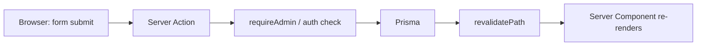

## Request flow

Almost everything is a **Server Component** reading straight from Prisma —
there's no separate client-side data-fetching layer. Mutations go through
**Server Actions** (`"use server"` functions in `src/lib/actions/*.ts`),
called directly from `<form action={...}>` — no hand-written API routes for
CRUD, no client-side fetch/JSON wiring.

The only real Route Handlers (`route.ts`) in the app are:

- `app/api/auth/[...nextauth]/route.ts` — Auth.js's own handler
- `app/api/files/resumes/[filename]/route.ts` — streams a resume file back
  after an auth + ownership check (see [Resume Uploads](/docs/resume-uploads))

## Next.js 16 conventions this app relies on

This project was built against Next.js 16, which changed several things
from earlier versions that are easy to get wrong if you're used to Next 14/15:

- **`params` and `searchParams` are `Promise`s**, always awaited:
  `const { id } = await params`. Every dynamic page in this app follows
  that pattern.
- **`middleware.ts` is renamed `proxy.ts`**, and the exported function is
  `proxy`, not `middleware`. See [Auth & Roles](/docs/auth-roles) — this is
  where route-level admin gating happens.
- **Turbopack is the default** dev/build bundler (no `--turbopack` flag
  needed).
- **Server Actions have a request body size limit** (1MB by default) — this
  app raises it to 5MB in `next.config.ts` so resume uploads fit. See
  [Resume Uploads](/docs/resume-uploads).

## Route groups

Everything except `/docs` lives under `app/(site)/`. That's a
[route group](https://nextjs.org/docs/app/api-reference/file-conventions/route-groups) —
the parentheses don't appear in the URL, they just let `(site)/layout.tsx`
apply a `max-w-5xl` centered `<main>` wrapper to the public site without
also squashing the Fumadocs sidebar layout under `/docs`, which needs full
width. The root `layout.tsx` only holds what's truly global: fonts, the
`<Nav>` header, and Fumadocs' `RootProvider`.

## Defense in depth on admin routes

Both `/admin/*` and `/docs/*` are admin-only, and both are checked in two
places:

1. **`src/proxy.ts`** — runs before the request reaches any page, redirects
   non-admins to `/login`. This is the fast, request-level check.
2. **The route's own layout** (`app/(site)/admin/layout.tsx`,
   `app/docs/layout.tsx`) — re-checks the session and redirects again.

The second check isn't redundant: `proxy.ts` is explicitly documented by
Next.js as an *optimistic* check, not a full authorization solution (it
can't safely do slow work like a database read on every request). Real
authorization always happens again inside the Server Component or Server
Action that actually touches data — see [Auth & Roles](/docs/auth-roles).
